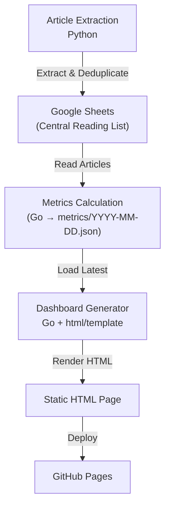

## What is From Links to Reading Insights?

In this post, we will explore **From Links to Reading Insights**. *This is Part 2 of my journey building a Personal Reading Analytics. Catch up on [Part 1 - From PIi to Cloud Automation](https://victoriacheng15.vercel.app/blog/from-pi-to-cloud-automation)*

## Article Extractor → Analytics

In Part 1, I shared how a simple Python script—born from the desire to collect links from my favorite blogs—evolved from manual runs on my laptop to a scheduled GitHub Actions workflow. But once articles were reliably flowing into Google Sheets, a new question emerged:

What if I could understand my reading habits and not just collect them?

That question sparked the next phase: building a personal reading analytics, powered entirely by open tools and zero infrastructure.

---

## From Links to Insights

The goal shifted from “Where are the new articles?” to questions that reveal real behavior and patterns:

- Am I actually reading what I save—or just collecting links?  
- Which sources give me the most value versus the most backlog?  
- How has my reading habit changed over months or years?  
- What’s the age of my oldest unread articles, and which sources contribute most to my unread pile?

To answer these, I moved beyond raw data and built a metrics engine that computes reading progress, backlog aging, and source-level analytics. This engine powers a full analytics with seven interactive visualizations—tracking everything from monthly trends to unread article age distribution—without relying on servers, databases, or paid infrastructure.

---

## The Pipeline: Simple, Batched, and Static

Here is how it works today:

---

## Go for Metrics, HTML for Portability

The analytics engine is a lean Go program that transforms raw article data from Google Sheets into meaningful reading insights. It computes:

- **Reading progress**: total articles, read vs. unread counts, and overall read rate with visual emphasis  
- **Temporal patterns**: articles per month, seasonal trends, and publication year distribution  
- **Backlog analysis**: unread article age buckets (<1 month, 1–3 months, 3–6 months, 6–12 months, >1 year)  
- **Source-level metrics**: read percentage per source, most and least read providers, and Substack author averages  
- **Spotlight highlights**: top 3 oldest unread articles with direct links and age calculations  

All results are written to a timestamped JSON file like `metrics/2025-12-29.json`. At runtime, the dashboard simply loads the latest file—no database, no API, no dynamic server.

A second Go process uses `html/template` to generate a static `index.html` with seven interactive Chart.js visualizations. The entire site deploys to GitHub Pages via GitHub Actions, delivering a live, zero-cost reading analytics dashboard that updates daily.

---

## Summary

- Phase 1: Automate article collection with GitHub Actions  
- Phase 2: Add metrics and visualization using Go and GitHub Pages  
- Result: A personal, zero infrastructure reading analytics dashboard  

Sometimes, the best observability starts at home—with your own habits.

---

## Thank You

Thank you for reading! You’re awesome, and I hope this post helped. Until next time!
