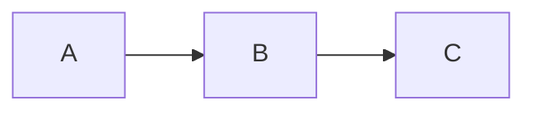

## Why My Pages Went Blank

I usually draft my blog posts in GitHub Issues because it’s easier to manage ideas there, and I can leverage GitHub Actions to automate my publishing workflow. For example, I have a custom Action that sends finished drafts to my mehub repo. Another bonus is that GitHub natively supports Mermaid.js, so diagrams “just work” while I’m drafting.

When I moved the drafts into my Astro blog, the diagrams didn’t render locally—which I expected. I had added `rehype-mermaid`, and honestly, I thought “just installing the package should make it work magically” 😅.

But then things took a turn: in production on Vercel, the entire page went blank. The builds still reported success, and posts without diagrams rendered fine, so at first glance, nothing seemed wrong.

After some digging, I learned that Mermaid diagrams actually need to be rendered during the build phase using Playwright. Since Vercel doesn’t include Playwright by default, the diagrams never rendered, and the page went blank.

The fix was to add a custom build workflow that installs Playwright so Astro can handle Mermaid diagrams correctly. With that in place, the builds finally worked, and my diagrams rendered just as they did back in GitHub Issues—only this time on my actual blog.

---

## The Problem: Silent Build Failures

I used `rehype-mermaid` to transform code blocks into diagrams during the build:



But once deployed, the page went blank. Not just the diagram — all content disappeared. No errors. No warnings.

When I inspected the built HTML, I saw that no elements were generated at all. The problem was rehype-mermaid itself: outside of a browser, it relies on Playwright
 to run Mermaid in a headless Chromium environment. Without Playwright available, the plugin can’t render any SVG output, leaving Astro with empty HTML. This explained why the rest of my site worked fine, but any post with Mermaid diagrams failed entirely.

---

## Why Mermaid Needs a Browser

Even though `rehype-mermaid` runs at build time, it still depends on the Mermaid JS library, which normally runs inside a browser. To make this work in Node environments, `rehype-mermaid` delegates the rendering to **Playwright**, which spins up a headless Chromium instance.

Without Playwright installed:

- Mermaid never runs.
- The plugin produces no output.
- Astro builds the page, but the result is empty HTML.

---

## The Solution: Bring Your Own Browser

By default, Vercel’s build environment doesn’t include Playwright, so `rehype-mermaid` cannot render diagrams during static generation. 

To fix this, I moved the **build step** into GitHub Actions, where I control the environment. By installing Playwright and Chromium in the CI pipeline, the build has access to a real browser context. Now `rehype-mermaid` can render Mermaid diagrams safely, producing fully static HTML that works in production.

---

## My GitHub Actions Workflow

To pre-render Mermaid diagrams, I use a GitHub Actions workflow that installs Playwright and Chromium before building the Astro site. This ensures `rehype-mermaid` can generate SVGs in a headless browser environment.

```yaml
      - name: Cache Playwright browsers
        uses: actions/cache@v4
        with:
          path: ~/.cache/ms-playwright
          key: playwright-browsers-${{ runner.os }}-${{ hashFiles('**/package-lock.json') }}
          restore-keys: |
            playwright-browsers-${{ runner.os }}-

      - name: Install Playwright
        run: npm install -D @playwright/test@latest
      
      - name: Install Playwright browsers
        run: npx playwright install chromium
```

For a complete guide on setting up GitHub Actions with Vercel for preview and production deployments, check out [Vercel’s official guide](https://vercel.com/guides/how-can-i-use-github-actions-with-vercel).

### Key Points:

- Caching Playwright browser speeds up builds.
- Install Chromium to satisfy native requirements.
- Running `vercel build` in this environment means Mermaid diagrams are **fully rendered to static HTML** before deployment.

---

## The Result

Now, every time I push a post with Mermaid diagrams:

✅ The build runs in a browser-capable environment  
✅ Diagrams are transformed into clean SVGs  
✅ Output is 100% static HTML  
✅ No blank pages in production  

---

## Final Thoughts

At first, I thought it would be as simple as adding the package and everything would just work… XD. But nope. That’s when the real investigation started.

Along the way, I discovered that Playwright only provides official support for Ubuntu, while my WSL setup was Fedora. That limitation led me to set up a custom deployment workflow on Vercel for previews. With that in place, I could finally view Mermaid diagrams in a preview link before pushing to production.

Looking back, I actually enjoyed the process: try something new, hit a wall, debug, and come out the other side having learned something new. Problems like this remind me that the “gotchas” are often where the best learning happens.

## Thank you

Big thanks for reading! You’re awesome, and I hope this post helped. Until next time!
