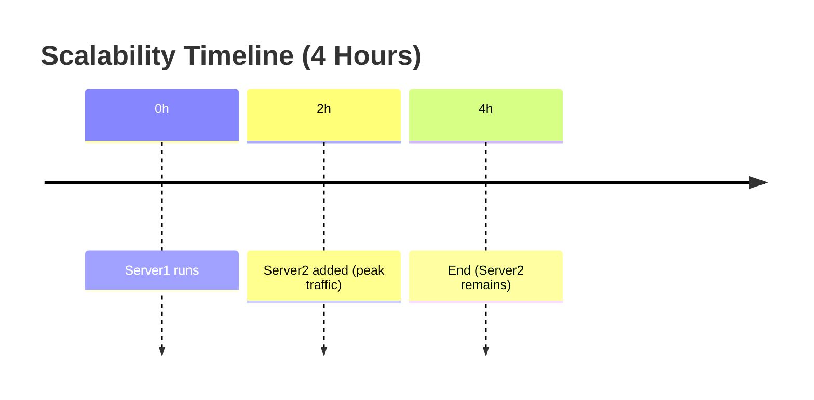
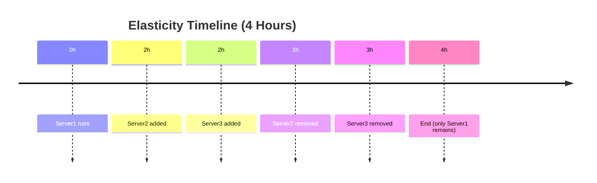

## Understanding Elasticity vs Scalability

When I first started working with cloud infrastructure, I often heard the terms **elasticity** and **scalability** used almost interchangeably. After some hands-on experience and research, I realized that while they are related, they are **not the same**. Understanding the difference is crucial, especially if you want to design **cost-efficient and resilient systems**.  

---

### What is Scalability?

**Scalability** is a system’s **ability to handle growth**. In simple terms, a scalable system can handle more users, data, or requests if we add more resources.  

- **Manual or automatic:** Scalability doesn’t have to be automatic. You could add more servers manually or use automated scripts.  
- **Growth only:** Traditional scalability focuses on **adding capacity**, not necessarily reducing it.  

**Example:**  
Imagine you run a web app on a single server. As traffic grows, you deploy a second server. Even if traffic drops at night, those two servers continue running. The system **handled growth**, so it’s scalable, but it’s **not elastic**.  

#### Diagram: Scalability (grows but doesn’t shrink)

---

### What is Elasticity?

**Elasticity** is the ability of a system to **automatically grow or shrink resources based on demand**. It’s what makes cloud computing powerful because you pay only for what you need while maintaining performance.  

- **Automatic adjustment:** Resources increase during high traffic and decrease during low traffic.  
- **Dynamic scaling:** Works both ways — grow when busy, shrink when idle.  

**Example:**  
On Black Friday, your cloud app might automatically scale from 5 servers to 50 servers as user traffic spikes. After midnight, it scales back to 5 servers. This automatic adjustment is **elasticity in action**.  

#### Diagram: Elasticity (auto scale up and down)

---

### Scalability vs Elasticity: The Key Difference

| Feature | Scalability | Elasticity |
|---------|------------|-----------|
| Automatic? | Optional | Required |
| Shrinks resources? | Usually no | Yes |
| Focus | Handle growth | Handle growth & drop dynamically |
| Cloud relevance | Design-level | Runtime-level (auto-scaling) |

**Quick takeaway:**  

- **Scalability = system can grow**  
- **Elasticity = system automatically grows and shrinks**

---

### Why It Matters

Understanding the difference helps in designing systems that are **resilient, cost-efficient, and cloud-native**.  

- Use **scalability** when planning long-term growth.  
- Use **elasticity** when you want resources to adapt in real-time, saving cost while maintaining performance.  

---

### Closing Thoughts

For anyone building cloud applications today, **elasticity is the norm**, but it’s built on top of **scalable system design**. If your system isn’t scalable, you can’t make it elastic. So always start with a **solid scalable architecture** — then layer elasticity on top to make it cloud-ready.  

## Thank you

Big thanks for reading! You’re awesome, and I hope this post helped. Until next time!
