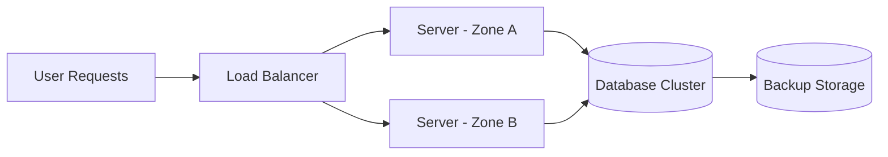

## 🧠 Understanding High Availability

**High Availability (HA)** means designing systems to stay online and accessible **as much as possible**, even when parts of the system fail.  

No system can achieve 100% uptime — hardware, network, or software failures are inevitable.  
High availability aims to **minimize downtime** by using redundancy and smart design to keep services running when something breaks.

Cloud providers often describe availability in terms of **“nines”** — a simple way to express how reliable a system is:

| Availability | Max Downtime per Year |
|---------------|----------------------|
| 99% (“two nines”) | ~3.65 days |
| 99.9% (“three nines”) | ~8.76 hours |
| 99.99% (“four nines”) | ~52 minutes |
| 99.999% (“five nines”) | ~5 minutes |

So when a company says its service has *four nines of availability*, it means that, on average, users might experience less than an hour of downtime per year.

---

## ☕ A Simple Analogy

Imagine you run a coffee shop.  
You only have one espresso machine. If it breaks, you can’t serve coffee — your business is “down.”  

Now, imagine you have **two espresso machines**. If one fails, the other still works. You stay open, serve customers, and fix the broken one later.  

That’s **high availability** — having backups and redundancy so you can keep operating when something fails.

---

## 🌐 High Availability in the Cloud

In the cloud, high availability is achieved by **removing single points of failure** and **distributing workloads** across multiple zones or regions.  

If one data center goes down, another automatically takes over.  
This design ensures that the system continues to operate — maybe with slightly reduced capacity, but without total downtime.

Here’s a simplified view of how that looks:

✅ **Explanation:**  
A **load balancer** routes incoming requests to multiple servers (often across different zones).  
If one server or zone fails, traffic is sent to another healthy one.  
The database might also be replicated, so it can fail over to a standby copy if needed.  

This redundancy ensures that your application remains available, even when something breaks behind the scenes.

---

## ⚖️ The Trade-offs

Building for high availability comes with trade-offs:

- **Cost:** Redundancy means running extra servers or databases.  
- **Complexity:** Managing multiple zones or replicas adds operational overhead.  
- **Maintenance:** Updates and testing become more complicated.  
- **Limits:** Even with HA, 100% uptime isn’t realistic — there will always be brief maintenance windows or external outages.

The key is to design for the right level of availability for your use case.  
A small side project might aim for 99.5% uptime, while a financial system might need 99.99%.

---

## 💬 My Takeaway

Learning about high availability helped me see that it’s less about perfection and more about **resilience**.  

Failures are guaranteed — what matters is whether your system can **recover quickly** and **keep users happy** while doing so.  

Even small projects can apply the same thinking.  For example, I could:

- Run my Flask API on multiple containers  
- Add health checks and automatic restarts  
- Store backups in another region  

> For instance, if I run my Flask API in 4 containers with Kubernetes, one container can fail and the others keep serving traffic while Kubernetes automatically replaces the failed one.  

These steps might sound small, but they’re practical ways to make a system more reliable.  

In short:  
> **High availability is about expecting failure — and designing for it before it happens.**
---

## Thank you

Big thanks for reading! You’re awesome, and I hope this post helped. Until next time!
