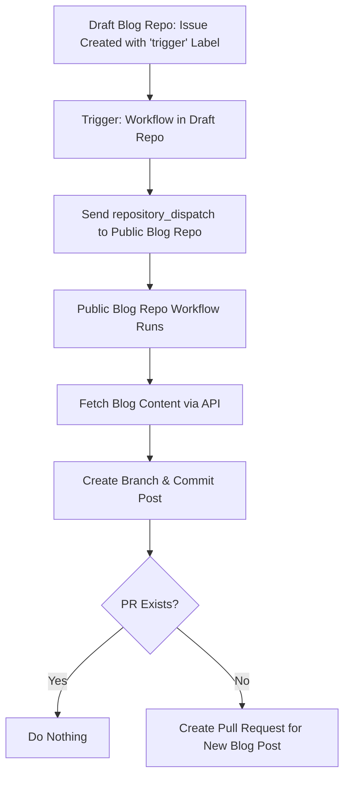

## How to Trigger Workflows

Workflows in GitHub Actions can be triggered in multiple ways, such as on pushes, pull requests, or manually. Beyond these basic triggers, workflows can also trigger other workflows, either **within the same repository** or **across different repositories**. Understanding the differences helps you design automation that is both efficient and maintainable.

## Trigger Workflows From the Same Repo

GitHub Actions allows one workflow to trigger another in the same repository using the `workflow_run` event. This is useful when separating concerns, such as building and deploying, in different workflows.


```yml
# workflow-a.yml
name: Workflow A
on:
  push:
    branches: [main]
  workflow_dispatch:

jobs:
  build:
    runs-on: ubuntu-latest
    steps:
      - run: echo "Workflow A ran!"
```

```yml
# workflow-b.yml
name: Workflow B
on:
  workflow_run:
    workflows: ["Workflow A"]
    types:
      - completed

jobs:
  deploy:
    runs-on: ubuntu-latest
    steps:
      - run: echo "Workflow B triggered by Workflow A!"
```

With this setup, every time **Workflow A** completes on the `main` branch, **Workflow B** is automatically triggered.

## Triggering Workflows Across Different Repositories

Sometimes you want to trigger a workflow in another repository. For this, GitHub provides the `repository_dispatch` event. This requires a **Personal Access Token (PAT)** stored as a secret to authenticate between repos.

```yml
# repo-A: trigger.yml
name: Trigger Repo B
on:
  workflow_dispatch:

jobs:
  trigger:
    runs-on: ubuntu-latest
    steps:
      - name: Trigger Repo B
        run: |
          curl -X POST \\
            -H "Authorization: token ${{ secrets.REPO_B_PAT }}" \\
            -H "Accept: application/vnd.github.v3+json" \\
            -d '{"event_type": "run-workflow"}' \\
            https://api.github.com/repos/username/repo-B/dispatches
```

```yml
# repo-B: workflow.yml
name: Repo B Workflow
on:
  repository_dispatch:
    types: [run-workflow]

jobs:
  build:
    runs-on: ubuntu-latest
    steps:
      - run: echo "Repo B workflow triggered by Repo A!"
```

This minimal example shows the mechanics without extra complexity.

## Blog Draft Sync Between Repositories

In my personal workflow, I maintain a **draft blog repo** and a **public blog repo**. A workflow in the draft repo:

- Sends a `repository_dispatch` to the public blog repo
- Fetches the content from an API
- Creates a PR with the new blog post

This setup automates the content sync while keeping drafts private until ready for publication.


### From Private Repo

```yml
name: Trigger Blog Sync

on:
  issues:
    types: [labeled]
  workflow_dispatch:

jobs:
  trigger:
    runs-on: ubuntu-latest
    if: github.event.label.name == 'trigger'
    steps:
      - name: Notify blog repo
        run: |
          curl -X POST \\
            -H "Authorization: token ${{ secrets.TRIGGER_TOKEN }}" \\
            -H "Accept: application/vnd.github.v3+json" \\
            -d '{
              "event_type": "sync-blog-post",
              "client_payload": {
                "issue_id": ${{ github.event.issue.number }},
                "issue_title": "${{ github.event.issue.title }}"
              }
            }' \\
            https://api.github.com/repos/username/repo/dispatches
```
### Public Repo

```yml
name: Sync Blog Post
on:
  repository_dispatch:
    types: [sync-blog-post]
  workflow_dispatch:

jobs:
  post:
    runs-on: ubuntu-latest
    steps:
      - uses: actions/checkout@vx.x.x
        with:
          fetch-depth: 0
      # do your thing
```

> **Important Note:** The `event_type` in the private repo workflow must match the `types` in the public repo workflow. This ensures that the `repository_dispatch` event correctly triggers the workflow in the public repo.

> For the full workflow implementation, [view it here](https://github.com/victoriacheng15/mehub/blob/main/.github/workflows/sync-blog-post.yml).

### How it Works (Diagram)



## Thank you

Big thanks for reading! You’re awesome, and I hope this post helped. Until next time!
