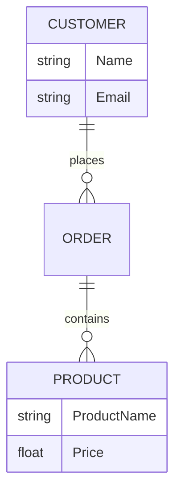
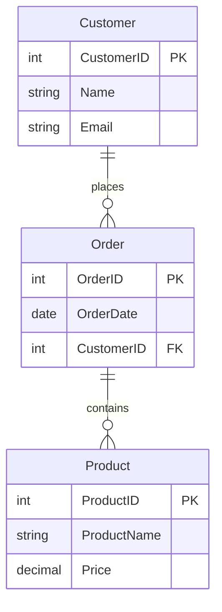
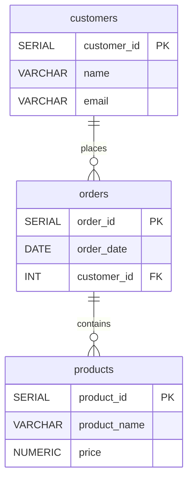

## 🔍 What Is Data Modeling?

Data modeling is the process of designing how data is organized, stored, and related in a database or system. Think of it as creating a blueprint for your data — just like an architect draws blueprints before building a house.

Good data modeling helps ensure your data is consistent, easy to understand, and efficient to query. It’s a foundational skill for software engineers, database admins, and anyone working with data-driven applications.

## 🏗️ Types of Data Models

There are three main levels of data modeling:

### 1. Conceptual Data Model

- **Purpose:** Defines *what* the data is and the high-level relationships.  
- **Focus:** Business concepts, entities, and how they relate.  
- **Audience:** Business stakeholders and analysts.  
- **Example:** “Customer places Order.” (No mention of tables or keys.)

### 2. Logical Data Model

- **Purpose:** Describes the *structure* of the data without considering physical implementation.  
- **Focus:** Entities, attributes, and relationships, often normalized.  
- **Audience:** Data architects and database designers.  
- **Example:** “Customer table has `CustomerID`, `Name`, `Email` and relates to Order table via `CustomerID`.”

### 3. Physical Data Model

- **Purpose:** Specifies *how* the model is implemented in a specific database.  
- **Focus:** Tables, columns, data types, indexes, constraints, and storage details.  
- **Audience:** Database administrators and developers.  
- **Example:** In PostgreSQL: `CustomerID` is `SERIAL PRIMARY KEY`, `Email` is `VARCHAR(255) UNIQUE`.

## 🧩 Core Components of Data Modeling

### Entities

Entities are the main objects or things you want to store data about, like `User`, `Product`, or `Order`.

### Attributes

Attributes are properties or details about an entity, like a user’s `name`, `email`, or `date_of_birth`.

### Relationships

How entities relate to each other. For example, a `User` can have many `Orders`.

## 📚 Example: Simple E-Commerce Data Model

- Entities: `User`, `Product`, `Order`  
- Relationships:  
  - A `User` can place many `Orders`  
  - An `Order` contains many `Products`

### Conceptual Model Diagram

### Logical Model Diagram

### Physical Model Diagram

## 🎯 Why Good Data Modeling Matters

- **Data Consistency:** Avoid duplicate or conflicting data  
- **Performance:** Efficient queries and indexing  
- **Scalability:** Easier to extend or modify as requirements change  
- **Communication:** Clear documentation for developers and stakeholders

## 🔧 Tips for Effective Data Modeling

- Start with the conceptual model before diving into technical details  
- Normalize data to reduce redundancy, but denormalize when performance needs it  
- Use tools like ER diagrams (Entity-Relationship diagrams) for visualization  
- Collaborate with domain experts to understand real-world data and rules

## 🎯 Final Thoughts

Data modeling might seem abstract at first, but it’s crucial for building reliable, scalable software. Investing time in good models early can save headaches later.

## Thank you

Big thanks for reading! You’re awesome, and I hope this post helped. Until next time!
