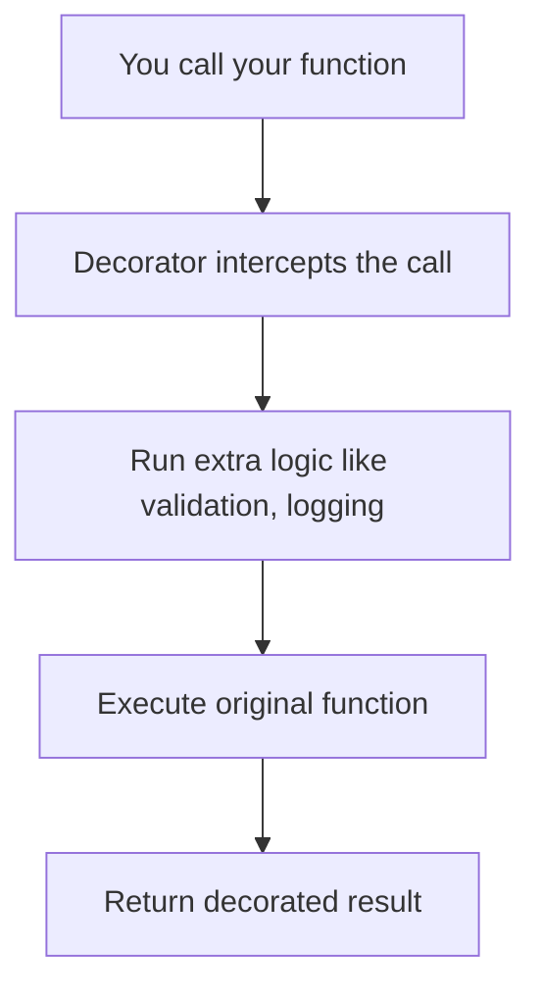

## What Is a Decorator?

Python decorators used to feel a bit confusing to me, but once I started using them in real projects, I realized how powerful they are—especially for reducing repetitive code like error handling. As I dug deeper, I learned that decorators are simply functions that wrap other functions to add extra behavior without modifying the original function’s code.

The idea clicked for me when I tried a small example.

- Step 1: Write a simple decorator

```py
def my_decorator(func):
    def wrapper(*args, **kwargs):
        print("Decorator: Before calling the function")
        result = func(*args, **kwargs)
        print("Decorator: After calling the function")
        return result
    return wrapper
```

- Step 2: Apply the decorator using `@`

```py
@my_decorator
def add(a, b):
    return a + b
```

- Step 3: Call the decorated function

```py
print("Result:", add(3, 5))
```

- Example output

```text
Decorator: Before calling the function
Decorator: After calling the function
Result: 8
```

This helped me understand the core idea:

- The decorator **intercepts the function call**
- It runs extra logic before or after the function
- Then it calls the original function as normal

Under the hood, this:

```py
@my_decorator
def add(a, b):
    return a + b
```

is the same as:

```py
add = my_decorator(add)
```

So `add()` becomes the `wrapper()` function defined inside the decorator.

---

## Why Decorators Are Helpful

As I wrote more Python, I noticed that many functions had the same repeated steps:

- printing logs  
- validating input  
- formatting responses  
- handling errors the same way  

This repetition isn’t just annoying—it also makes the code harder to maintain.  
Decorators let you move that shared logic into one place.

Here’s the overall idea:



Decorators are perfect for things like:

- logging  
- authentication checks  
- caching  
- input validation  
- retry logic  
- error handling  

Basically, anything you want to apply **across multiple functions**.

---

## How I Used a Decorator in My Project

In the `school-management-api` project, I noticed that several routes repeated the exact same error-handling pattern:

```py
try:
    # business logic
except ValueError:
    return {"error": ...}
except Exception:
    return {"error": ...}
```

After seeing this million of times, I decided to replace it with a decorator.

### My error-handling decorator

```py
def handle_exceptions_read(default_status_code=500):
    def decorator(func):
        @wraps(func)
        def wrapper(*args, **kwargs):
            try:
                return func(*args, **kwargs)
            except Exception as e:
                logging.exception("Unexpected error in read operation.")
                return api_response_error(
                    f"Internal server error: {str(e)}.", default_status_code
                )

        return wrapper

    return decorator
```

### Applying it to a route

```py
@handle_exceptions_read()
def handle_read_all_terms():
    active_only = request.args.get("active_only", "false").lower() == "true"
    terms = get_all_terms(active_only=active_only)
    return api_response(terms, "Terms fetched successfully.")
```

### Immediate benefits

So imagine this: the project has 9 routes total, and each route has both read and write operations. That means I would need to write error handling for all 18 methods. Later, if I needed to refactor or change the error response, I’d have to update 18 places manually. That’s where the decorator comes to the rescue:

- No more repeated try/except blocks  
- All endpoints return consistent error messages  
- If I want to change the error format, I only update **one place**  

This was the moment decorators felt genuinely useful, not just a fancy Python trick.

---

## Final Thoughts

Learning decorators was one of those “unlock” moments for me in Python. Once they made sense, I started spotting opportunities to use them everywhere—especially when I noticed repeated patterns in my code.

---

## Thank you

Big thanks for reading! You’re awesome, and I hope this post helped. Until next time!
